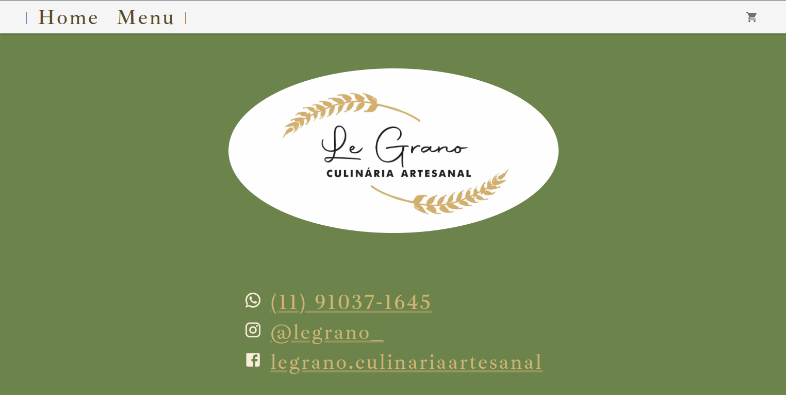
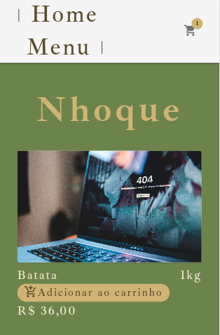

<div align="center">


</div>

<div align="right">

#### - Projeto finalizado 🟢

</div>
<div align="center">

# Legrano | Culinária artesanal

</div>


### <div align="center"> Aplicação em Reactjs/Typescript, abordando conceitos sobre: </div>

- [TypeScript](https://www.typescriptlang.org/) - Tipagens
- [Reactjs](https://pt-br.reactjs.org/) - useState | useEffect e useReducer
- [Localstorage](https://developer.mozilla.org/pt-BR/docs/Web/API/Window/localStorage) - Armzenamento de dados do carrinho
- [React Router DOM](https://reactrouter.com/docs/en/v6/getting-started/overview) - Roteamento de páginas
- [Mui](https://mui.com/) Componentes personalizados
- [ESLint](https://eslint.org/) - linter para código
- [Prettier](https://prettier.io/) - formatador de código
- [Husky](https://typicode.github.io/husky/#/) - Capturar determinado momento de um commit
- [Lint-staged](https://github.com/okonet/lint-staged) - Executar ações em determinado momento de um commit

## <div align="center">Requisitos</div>

Para executar a aplicação é necessário instalar algumas ferramentas tais como um editor de códigos para realizar compilação dos mesmos. Nesse projeto foi utilizado o [Visual Studio Code](https://code.visualstudio.com/), [NodeJS](https://nodejs.org/en/) para compilação do código, [Git Bash](https://gitforwindows.org/) para baixar o repositório e baixar todas as dependências necessárias.

```bash
# Clone este repositório(caso ja tenha feito isso no passo anterior, pule para o próximo comando)
$ git clone <https://github.com/Ricnaga/legrano-massas>

# Acesse a pasta do projeto no terminal/cmd
$ cd legrano-massas

# Instale as dependências
$ yarn (ou npm -i)

# Inicie a aplicação no lado do backend
$ yarn dev (ou npm run dev)

# A aplicação abrirá automaticamente um navegador com o endereço <http://localhost:3000>
```
